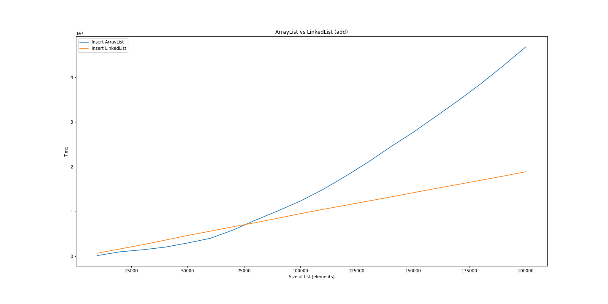
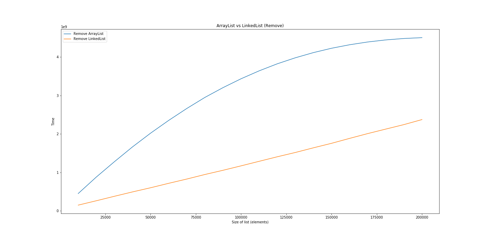
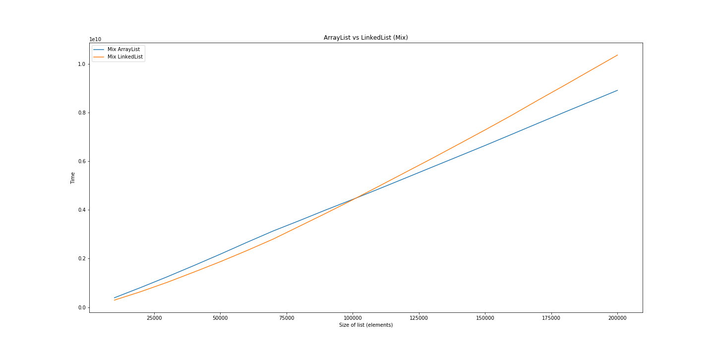
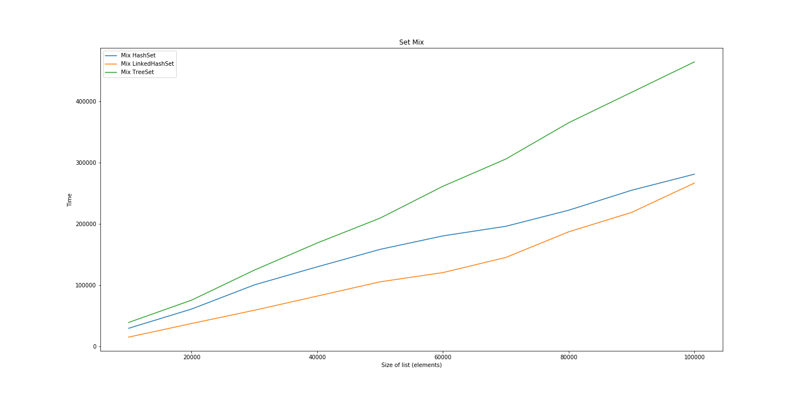

# Сравнение производительности ArrayList LinkedList
## [Таблица с результатами](./reports/report.csv)
## Вставка

## Доступ к элементу

## Поиск

## Удаление

## Амортизированная оценка

# Сравнение производительности HashSet LinkedHashSet TreeSet
## [Таблица с результатами](./reports/report_set.csv)
## Добавление

## Поиск

## Удаление

## Амортизированная оценка

# Сравнение производительности HashMap LinkedHashMap TreeMap
## [Таблица с результатами](./reports/report_map.csv)
## Добавление 

## Поиск

## Удаление

## Амортизированная оценка

# Сравнение производительности MyLinkedList LinkedList 
## [Таблица с результатами](./reports/report_mylinkedlist.csv)
## Вставка

## Доступ к элементу

## Поиск

## Удаление

## Амортизированная оценка

